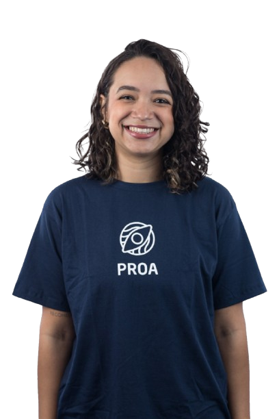
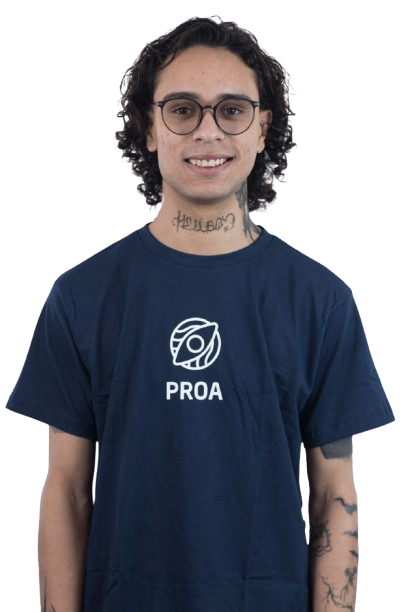
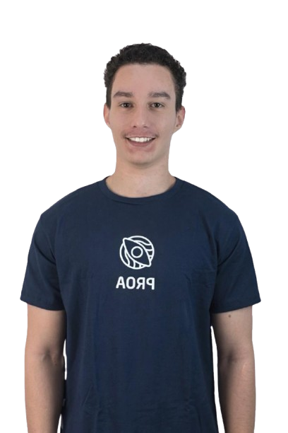
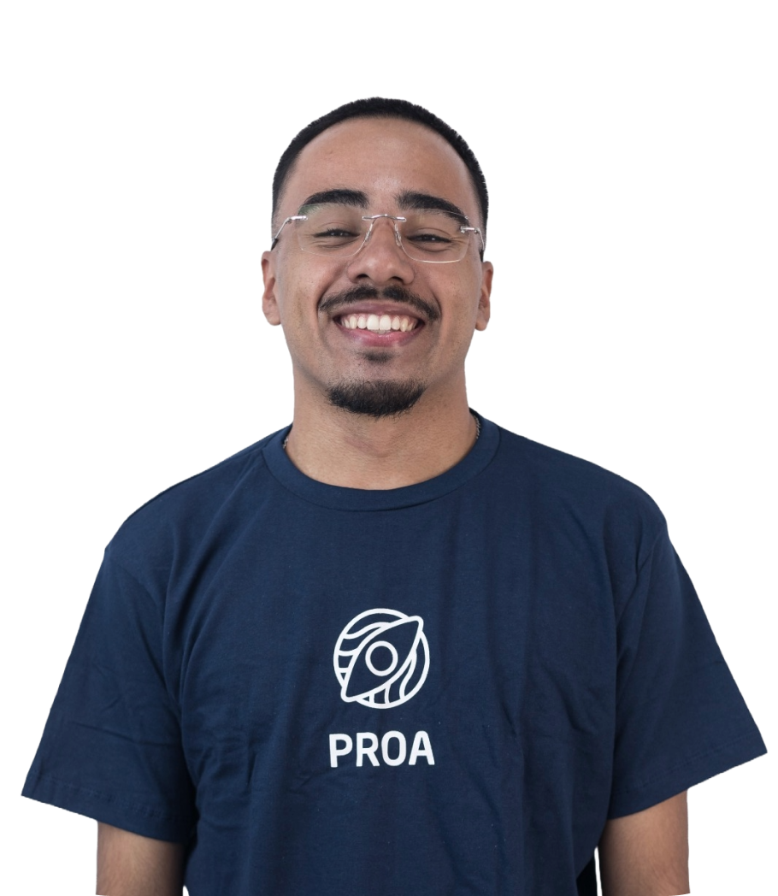
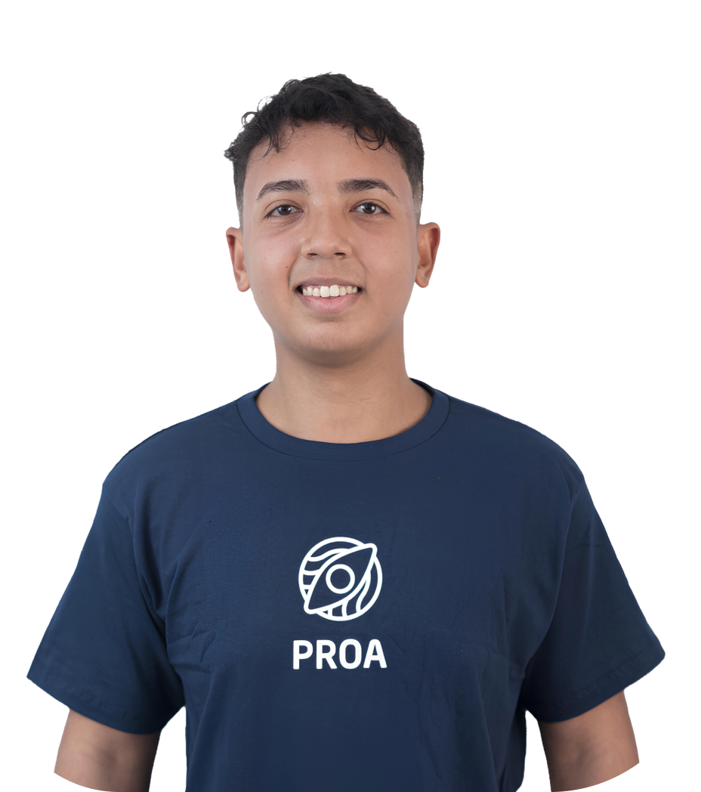

# Broto+

**Missão:** Vender mudas de alta qualidade diretamente de pequenos produtores, promovendo segurança, sustentabilidade e apoio aos microempreendedores.

**Visão:** Ser a principal referência em mudas no Brasil, incentivando o crescimento dos microempreendedores e contribuindo para a sustentabilidade ambiental.

**Valores:** Qualidade, sustentabilidade, apoio ao produtor, segurança e inovação.

## Tecnologias Utilizadas

-  **HTML:** Estrutura e conteúdo da aplicação.
-  **CSS:** Estilos e layout responsivo da página.
-  **Bootstrap:** Framework CSS para criar um design responsivo e moderno.
-  **JavaScript:** Lógica de interação da página e manipulação de dados.
-  **Figma:** Utilizado para criação dos protótipos de interface do usuário.
-  **VSCode:** Editor de código-fonte para desenvolvimento do projeto.

## Integrantes do Projeto

<table>
  <tr>
    <td align="center">
      
      <h3>Ana Beatriz</h3>
    </td>
    <td align="center">
      
      <h3>Victor Ramalho</h3>
    </td>
    <td align="center">
      
      <h3>Kaique</h3>
    </td>
  </tr>
  <tr>
    <td align="center">
      
      <h3>Lucas</h3>
    </td>
    <td align="center">
      
      <h3>Rapha</h3>
    </td>
    <td align="center">
      
      <h3>Wesley</h3>
    </td>
  </tr>
</table>

## Hospedagem do Projeto

O projeto está hospedado e pode ser acessado por meio do seguinte link:

[https://broto-mais.vercel.app/index.html](https://broto-mais.vercel.app/index.html)
